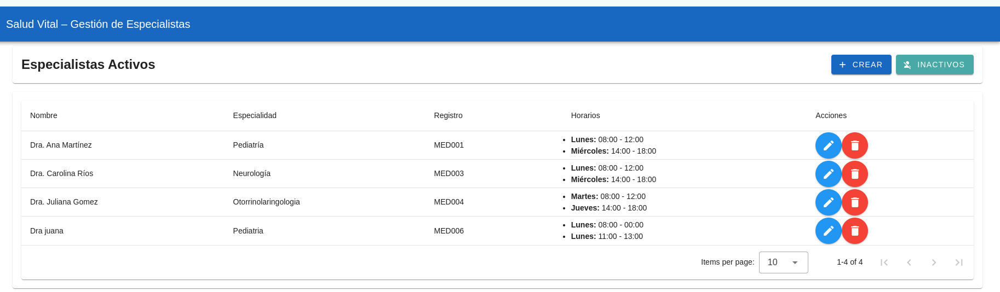
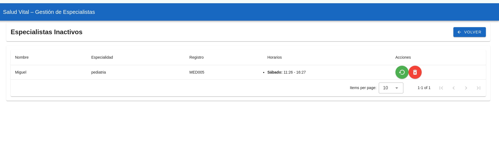

# 🩺 Gestión de Especialistas - Frontend

Este proyecto es el frontend del sistema de gestión de especialistas médicos. Permite realizar operaciones CRUD, gestionar horarios dinámicos, y aplicar validaciones tanto en el cliente como en el servidor. La interfaz está construida con Vue 3 + TypeScript y Vuetify.

## 🚀 Tecnologías

- [Vue 3](https://vuejs.org/)
- [TypeScript](https://www.typescriptlang.org/)
- [Vuetify 3](https://vuetifyjs.com/)
- [Vite](https://vitejs.dev/)
- [Pinia](https://pinia.vuejs.org/)
- `fetch` nativo para consumo de API

## 📂 Estructura

src/
├── components/
│ └── SpecialistForm.vue # Formulario reutilizable
├── layouts/
│ └── WireframeLayout.vue # Estructura principal con header y router-view
├── services/
│ └── SpecialistService.ts # Conexión con el backend usando fetch
├── views/
│ ├── SpecialistView.vue # Vista principal (activos)
│ └── SpecialistInactivesView.vue # Vista de inactivos con restaurar/eliminar
├── router/
│ └── index.ts # Definición de rutas
├── App.vue
└── main.ts

## ✅ Funcionalidades

### Especialistas Activos

- Crear especialista con horarios múltiples
- Editar especialista
- Eliminar especialista (soft delete)
- Validación visual de campos requeridos
- Validación de traslapes de horarios en el backend
- Feedback con `Snackbar`

### Especialistas Inactivos

- Restaurar especialista
- Eliminar definitivamente
- Confirmación modal en ambas acciones

## 🛠 Instalación

1. Clona el repositorio:

   ```bash
   git clone https://github.com/tu-usuario/frontend-especialistas.git
   cd frontend-especialistas

   ```

2. Instala dependencias:
   npm install

3. Ejecuta el servidor:
   npm run dev

🔗 El frontend está configurado para comunicarse con el backend en http://localhost:3333. Puedes ajustar esto en services/SpecialistService.ts.

## 📸 Capturas

### Especialistas Activos



### Especialistas Inactivos



🧠 Autor
Desarrollado como parte del Examen Técnico Fullstack Junior (SENA - Junio 2025).
